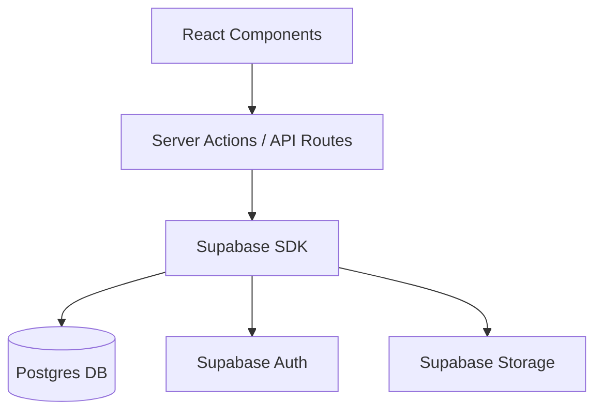

# Plan de Implementación: Modernización y Migración a Supabase

Este documento detalla la estrategia para modernizar la aplicación `client-fobeso-saas-convenios`, migrando de OracleDB a Supabase y mejorando la arquitectura general.

## Estado Actual

- **Stack:** Next.js 13 (Pages/App dir mix), OracleDB (Driver nativo), Azure Utils.
- **Problemas:** Seguridad crítica (middleware disabled), no connection pooling, deuda técnica en gestión de estado y datos.
- **Objetivo:** Migración completa a Supabase (Auth + DB + Storage) y refactorización a Next.js App Router limpio.

## Modelo de Datos Objetivo (Supabase)

Diseñado para soportar múltiples sucursales, categorización flexible y traqueo de uso.

- **`profiles`**: Extensión de `auth.users` (Cedula, Nombre, Rol).
- **`categories`**: Clasificación de convenios (Salud, Comida, etc.).
- **`companies`**: Empresas aliadas.
- **`branches`**: Sucursales físicas de las empresas (1:N con companies).
- **`deals`**: El convenio/cupón en sí.
- **`deal_usages`**: Registro de uso/canje de cupones por usuarios.

## Fases de Implementación

### Fase 1: Fundamentos y Base de Datos (📍 Estado Actual)

- [ ] **Setup Supabase:** Crear tablas, relaciones, índices y políticas RLS.
- [ ] **Configuración de Entorno:** Crear variables de entorno para Supabase.
- [ ] **Cliente Supabase:** Implementar `lib/supabase/client.ts` y `server.ts`.
- [ ] **Tipos TypeScript:** Generar definiciones de tipos basadas en la DB.

### Fase 2: Autenticación y Seguridad

- [ ] **Middleware:** Reactivar y reescribir `middleware.ts` usando Supabase Auth.
- [ ] **Login:** Reemplazar `api/auth/login` con Supabase Auth (Client Side).
- [ ] **Gestión de Sesión:** Asegurar persistencia y protección de rutas `/admin`.

### Fase 3: Migración de Funcionalidades (Vertical Slices)

- [ ] **Vertical 1 - Home/Recientes:** Migrar endpoint `GET /api/convenios/recientes`.
- [ ] **Vertical 2 - Detalle Convenio:** Migrar vistas de detalle y listados.
- [ ] **Vertical 3 - Admin CRUD:** Refactorizar el ABM de convenios/empresas.
- [ ] **Storage:** Reemplazar Azure Blob por Supabase Storage para logos de empresas.

### Fase 4: Limpieza de Deuda Técnica (Oracle Removal)

- [ ] Eliminar `oracledb` y `lib/db.js`.
- [ ] Eliminar SDKs de Azure.
- [ ] Estandarización de componentes UI y manejo de errores.

## Arquitectura de Software Propuesta

